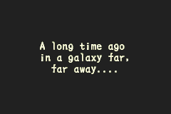

# Boktai - but Star Wars themed

This is very much a Work in Progress and might never finish.  
I pretty much started it on a whim and am not even super familiar with the Star Wars Universe.  
Please make suggestions or contribute directly if you have ideas for better character assignments and other changes.

Make sure to check out the Taiyoh Network Discord: <https://discord.gg/0dUb9OmJrIrRPFGf>

## Cast

- Django = Luke Skywalker
- Sabata = Han Solo
- Lita = Leia
- Ringo = Anakin Skywalker
- Mani = Padmé Amidala
- Otenko = Yoda
- The Count of Groundsoaking Blood = Darth Vader
- Queen Hel = Emperor Palpatine
- The Immortals = The Sith

Of course not all of them are great fits but if you constrain it to Boktai 1, they fit reasonably well i guess.

### Missing characters

- Carmilla
- Muspell
- Garmr
- all normal enemies

## Ideas for further changes

- Further adjustments to the text to fit the Star Wars theme
- Adjust Otenko's text to fit Yoda's way of speaking
- Better use the space in text boxes
- Correct weird line breaks caused by a different text length
- Change audio and visuals?

## How to use

1. Download [BokMagic](https://boktaihacking.net/wiki/BokMagic) and use it to extract the data from a Boktai 1 US ROM.
2. Then replace the `strings.xml` file in your output folder with the one from this repository.
3. In BokMagic, use `Project` > `Build` to create a new ROM that contains your changes.

Note: Use savefiles instead of savestates if you don't want to start a new playthrough.  
Savestates cause issues because then there is a mismatch between the data of the ROM and the RAM that is stored in the savestate.

## How to make changes

Just open the `strings.xml` file in a text editor of your choice, make changes and save it again.  
Then in BokMagic you just hit F6 to build and load up the new ROM.  
However, there are some parts that can cause issues when changed.  
Always verify these when making changes.  
A few examples:

- Text that is written like this `OTENKO=SAD` is used by the game to determine stuff like playing a certain animation.
- Tags like `&lt;WEIGHT>Text&lt;/WEIGHT>` are used for text formatting.
  - `UVMOJI` is text that is only visible if you have sunlight

What we can't do:

- Display characters that are not ASCII or in this list: <https://git.sr.ht/~raphi/bokmagic/tree/master/item/lib/resources/U3IE/encoding.tbl>
- Add more space than is available.
- Change the overall formatting of the xml file.
  - Spaces in front of text are preserved because they are sometimes used to reposition text.
  - `&lt;` is used instead of `<` because otherwise the tags of the game are interpreted as XML.

### Available space

- Item descriptions have 11 characters per line and up to 4 lines.
- Other text boxes: tbd
